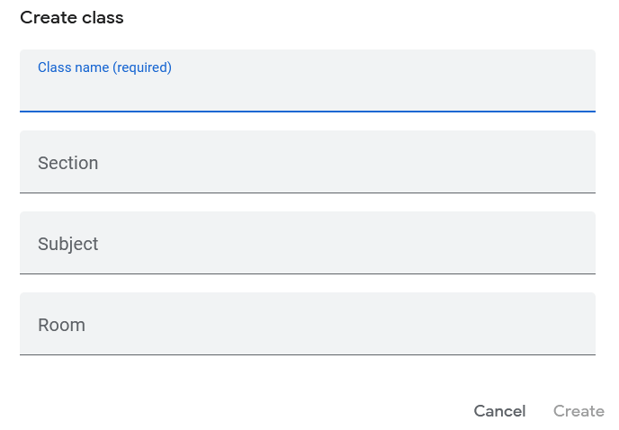

# Add a classroom

1. Login to [https://classroom.google.com] using your Kannada Academy credentials
2. Click the `+` button on the top-right corner, and select `Create class`
3. Enter the class information and click `Create`

Ensure that the classroom's name follows the recommended naming convention:

> <CONTINENT>-<COUNTRY>-<STATE/CITY>-<SCHOOLNAME>-<LEVEL>-<TEACHER-NAME>

For example:
> EU-NO-NKS-SB1-TEACHER1

.. toctree
   :glob:

   addusers
   invitegaudians
