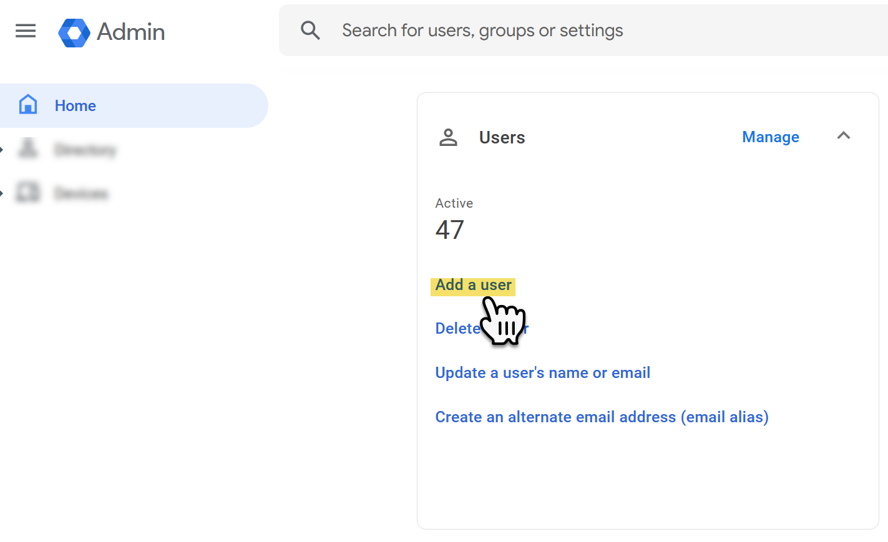
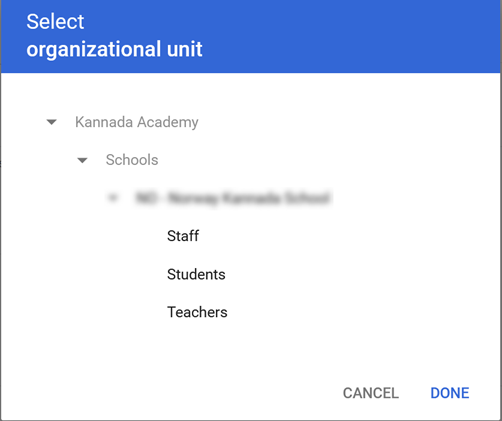
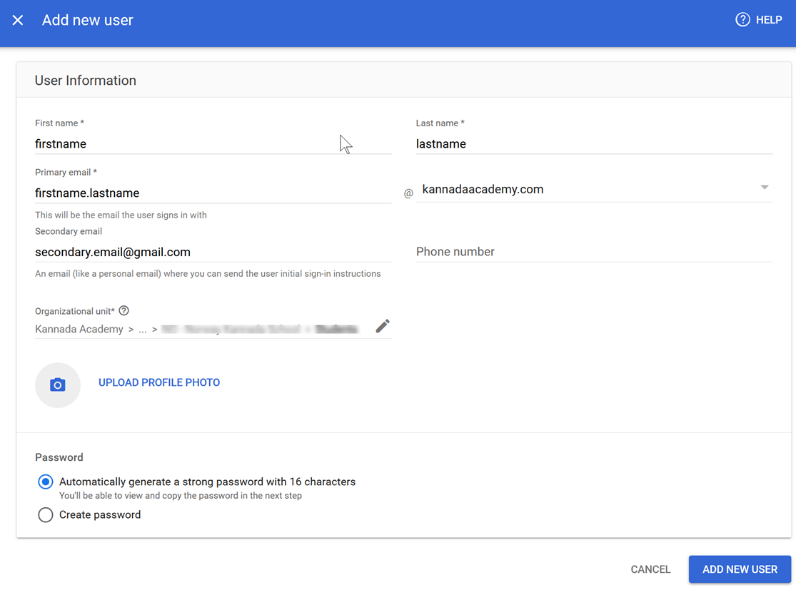

# Add a user

1. Open the browser and enter the following URL:
   > http::/admin.google.com
2. Login with your Kannada Academy ID and password
3. Click `Add a user`
   
   **figure 1:** Add new user option
4. Enter the `Firstname` and `lastname`
5. Enter `Primary email` which is usually `firstname.lastname`.
6. Click the pen icon next to the `Organizational unit` and choose
   your school and the corresponding group (`Teachers`, `Students`, or `Staff`).
   
   **figure 2.1:** Organizational unit of the new user
7. Choose one of the temporary `Password` methods and click `ADD NEW USER`

   